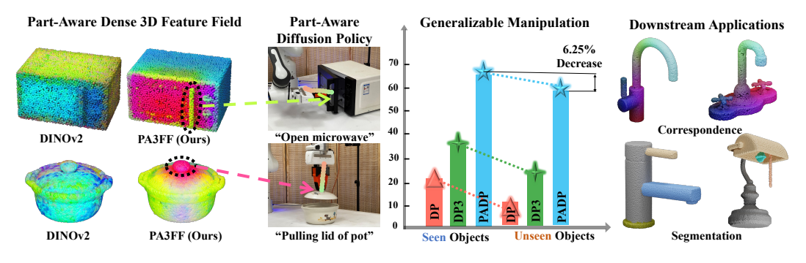
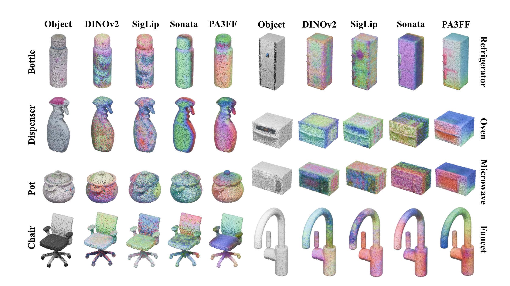

<div align="center">

## PA3FF: Learning Part-Aware Dense 3D Feature Field for Generalizable Articulated Object Manipulation

[](https://pa3ff.github.io/)
[](https://www.arxiv.org/pdf/2602.14193)
[](https://iclr.cc/)
[](https://pa3ff.github.io/#videos)

[Yue Chen*](https://yuechen0614.github.io/)<sup>1</sup>,
[Muqing Jiang*](https://muqingj.github.io/)<sup>1</sup>,
[Kaifeng Zheng*]()<sup>2</sup>,
[Jiaqi Liang](https://scholar.google.com/citations?user=LTiSIEcAAAAJ&hl=zh-CN)<sup>1</sup>,
[Chenrui Tie](https://crtie.github.io/)<sup>3</sup>,
[Haoran Lu](https://luhr2003.github.io/)<sup>1</sup>,
[Ruihai Wu](https://warshallrho.github.io/)<sup>1†</sup>,
[Hao Dong](https://zsdonghao.github.io/)<sup>1†</sup>

<sup>1</sup>Peking University, <sup>2</sup>Beijing Institute of Technology, <sup>3</sup>National University of Singapore  
<sup>*</sup>Equal contribution, <sup>†</sup>Corresponding authors

</div>

<p align="center">
  
</p>

## Overview

PA3FF learns a **part-aware dense 3D feature field** for articulated objects, enabling better generalization in manipulation-related perception and representation learning. This repository contains the training, evaluation, and visualization code used in the paper.

## Quick Start

### 1. Environment setup

The codebase was tested in a Slurm-based environment with Python `3.10.8` and CUDA `12.1.1`.

```bash
module load Python/3.10.8
module load CUDA/12.1.1

python3 -m venv ./venv/pa3ff
source ./venv/pa3ff/bin/activate

pip install numpy==1.26.4 torch==2.1.0 torchvision==0.16.0 torchaudio==2.1.0 \
  --extra-index-url https://download.pytorch.org/whl/cu121
pip install -r requirements.txt
pip install cudf-cu12==24.6.* cuml-cu12==24.6.* --extra-index-url https://pypi.nvidia.com
pip install torch-scatter -f https://data.pyg.org/whl/torch-2.1.0+cu121.html

cd libs/pointops
python setup.py install
cd ../..

cd libs
git clone https://github.com/facebookresearch/sonata.git
pip install -e ./sonata
cd ..

pip install ninja git+https://github.com/NVlabs/tiny-cuda-nn/#subdirectory=bindings/torch
pip install flash_attn==2.7.3 --no-build-isolation
```

### 2. Prepare the dataset

1. Download `partnet-mobility-v0.zip` from the [PartNet-Mobility Dataset](https://sapien.ucsd.edu/downloads).
2. Place the archive under the project root and extract it into `./partnet`.
3. Keep only the objects with detailed part annotations:

```bash
unzip -q partnet-mobility-v0.zip \
  -x "dataset/[0-9][0-9][0-9][0-9][0-9][0-9]*/*" \
  -d ./partnet
```

4. Run preprocessing:

```bash
python scripts/preprocess.py
```

This step will:

- collect category-level part descriptions
- remap labels into category-specific part ids
- create `train/` and `val/` splits as symlinks

### 3. Prepare Sonata checkpoint

Download `sonata.pth` by following the [Sonata quick start guide](https://github.com/facebookresearch/sonata#quick-start), then place it at:

```bash
./libs/sonata/ckpt/sonata.pth
```

## Training

Run:

```bash
bash scripts/train.sh -n <exp_name> -t <category>
```

Example:

```bash
bash scripts/train.sh -n base -t bottle
```

Useful arguments:

- `-n`: experiment name
- `-t`: object category
- `-g`: number of GPUs
- `-p`: python interpreter path
- `-w`: initialization checkpoint
- `-r`: resume training

## Evaluation

Run:

```bash
bash scripts/eval.sh -n <exp_name> -w <weight_name> -t <category>
```

Examples:

```bash
bash scripts/eval.sh -n base -w last -t bottle
bash scripts/eval.sh -n base -w 5000 -t bottle
```

Generated point cloud visualizations will be saved to:

```bash
./exp/<exp_name>/vis_pcd/
```

<p align="center">
  
</p>

## Supported Categories

The repository already includes category embedding files for:

`bottle`, `chair`, `clock`, `dishwasher`, `display`, `door_set`, `faucet`, `keyboard`, `lamp`, `laptop`, `microwave`, `mug`, `pot`, `refrigerator`, `scissors`, `storage_furniture`, `table`, `trash_can`

## Repository Layout

```text
PA3FF/
├── assets/              # README figures
├── configs/             # training and runtime configs
├── launch/              # train/eval python entrypoints
├── libs/
│   ├── pointops/        # custom CUDA point operators
│   └── sonata/          # external dependency checkpoint/code
├── partnet/             # category embeddings and dataset assets
├── pointcept/           # core model, engine, utils, datasets
└── scripts/             # preprocessing, training, evaluation
```

## Notes

- The preprocessing script notes that the `.npy` category embeddings are already included in this repository.
- `scripts/eval.sh` resolves checkpoints from `./exp/<exp_name>/model/<category>/<weight>.pth`.
- If `-g` is not provided, both train and eval scripts automatically use all visible CUDA devices.

## Citation

If PA3FF is helpful to your research, please cite the paper:

```bibtex
@inproceedings{
chen2026learning,
title={Learning Part-Aware Dense 3D Feature Field For Generalizable Articulated Object Manipulation},
author={Yue Chen and Muqing Jiang and Ruihai Wu and Kaifeng Zheng and Jiaqi Liang and Chenrui Tie and Haoran Lu and Hao Dong},
booktitle={The Fourteenth International Conference on Learning Representations},
year={2026},
url={https://openreview.net/forum?id=qXfRXfAHOK}
}
```
